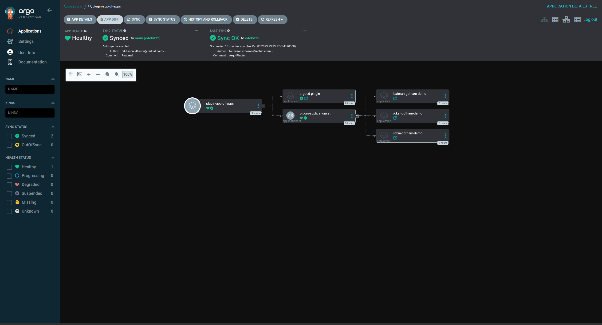

# ArgoCD Plugin Generator example


[ArgoCD Plugin Generator Operator Page](https://argo-cd.readthedocs.io/en/stable/operator-manual/applicationset/Generators-Plugin/)

---

## What you need to make it work

- Openshift 4.13 Cluster (Get Openshift local [Here](https://developers.redhat.com/products/openshift-local/overview?source=sso))
- Openshift-GitOps v1.10 (ArgoCD 2.8) ([Install Openshift-Gitops](https://docs.openshift.com/gitops/1.10/installing_gitops/installing-openshift-gitops.html))
- OC client (Get it From [here](https://docs.openshift.com/container-platform/4.13/cli_reference/openshift_cli/getting-started-cli.html#installing-openshift-cli))
- HELM cli (Get it From [Here](https://github.com/helm/helm/releases))
- yq (Get it from [Here](https://github.com/mikefarah/yq/#install))

---

## Please Fork this repo and update/change it to fit your deployment and needs

## the Application generated from the ApplicationSet can be found [here](https://github.com/gotham-demo), please also fork

## What we have here

### Lets explian nodeJS folder

under it we have:

- src folder, with the app.js file that contains our web-application server
- src/config, here we store a default app.yaml file with basic config
- argocd-plugin-app.postman_collection.json, Postman Colletion to assit with testing the POST request.
- automation.sh, script to assist with build, test and push the application image.
- Dockerfile, Multi-stage Docker file to build the applicaion container image.

#### Automation.sh file will make the working of running podman build/run/push more easy

The script accepts 2 running arguments the 1st is the commit message, the 2nd is the desired opertaion

- test, this will build and run the application image
- push, this will build and push the application image to the image registry, after it prompt to either update the HELM chart values file or not with the new image tag.
    to work with the file create an enviorment variable named IMAGE_NAME with your _image.registry/repo_name/image_, if you forgot the script will ask you for the image name in the first run.

#### Dockerfile

the Docker file build the application based on the _registry.access.redhat.com/ubi9/nodejs-18_ as builder and _registry.access.redhat.com/ubi9/nodejs-18-minimal_ as the final running container.

> During the build it will create a default token for the argocd plugin with _12345678_ as it's value.

#### Swagger-UI

The appliocation expose Swagger-UI at the _/api-docs_ (i.e <https://plugin-argo-plugin-openshift-gitops.apps-crc.testing/api-docs>).
To be able to see the JSON of the Web-Application you need to authorized the Swagger with the Auto-Generated token from the appliaction secret

To Get the secret:

```Bash
oc get secrets plugin-argocd-app-set-plugin-token -n openshift-gitops -o yaml | yq eval '.data.token' | base64 -d
```

After you have the Secret Click Authorize Button on the top right of the screen


After clicking it a pop-up menu will open there enter the token from the secret


Now you can see you plugin generator Payload converted to JSON.

---

### GitOps Folder

Under our GItops Folder we find 2 Sub Folders:

- Argo-Plugin, Holds our HELM Chart with it values file to deploy our plugin web-application
- ArgoApps, Holds all our argoCD object with kustomaized.

#### Argo-Plugin Folder

Please read the [README](GitOps/Argo-Plugin/README.md) file to under stand the Chart

Some Trick and Tips

Folder:

- Certificates, paste here your domain Cretificate and it will be added to the route that will be generated by the ingerss.
- ApplcaitionFiles, This is the **MOST** Importent folder, under it we will put our _app{n}.yaml_ files like the following, the application support multiple config files(i.e. batman.yaml, robin.yaml ,joker.yaml ...), and will merge them to single JSON Paylod:

example:
> batman.yaml

```YAML
GenerateApplication:
  name: batman
  project: gotham-demo
  image: quay.io/gotham/batman
  tag: 4a7050d
  repoURL: https://github.com
  branch: main
  gitopsRepo: gotham-cd
```

each new Object in GenerateApplication key with generate an Argo application via the application Set
you can add more or even change the schema, just adept the [ApplicationSet](GitOps/ArgoApps/Plugin/ApplicationSet-Plugin.yaml).

```YAML
apiVersion: argoproj.io/v1alpha1
kind: ApplicationSet
metadata:
  name: plugin-applicationset
  namespace: openshift-gitops
spec:
  generators:
    - plugin:
        configMapRef:
          name: plugin-config
        requeueAfterSeconds: 30
  template:
    metadata:
      name: "{{name}}-{{project}}"
    spec:
      project: argocd-plugin
      source:
        helm:
          valueFiles:
            - '{{project}}/develop/values-{{name}}.yaml'
          parameters:
            - name: "image.name"
              value: '{{image}}'
            - name: "image.tag"
              value: '{{tag}}'
            - name: "global.namespace"
              value: 'plugin-test'
        repoURL: '{{repoURL}}/{{project}}/{{gitopsRepo}}.git'
        targetRevision: '{{branch}}'
        path: Application
      destination:
        server: https://kubernetes.default.svc
        namespace: plugin-test
      syncPolicy:
        automated:
          prune: true
          selfHeal: true
        syncOptions:
          - CreateNamespace=true
```

- {{name}} - this is the _name_ object from each item in the GenerateApplication array. (i.e. the name of the application or what ever you thing that is relevent)
- {{project}} - this is the _project_ object from each item in the GenerateApplication array. (i.e. the orgenization name in GitHub)
- {{image}} - this is the _image_ object from each item in the GenerateApplication array. (i.e. quay.io/gotham/batman)
- {{tag}} - this is the _tag_ object from each item in the GenerateApplication array. (i.e. v1.0.1)
- {{repoURL}} - this is the _repoURL_ object from each item in the GenerateApplication array (i.e. <http://www.github.com>).
- {{branch}} - this is the _branch_ object from each item in the GenerateApplication array. (i.e. the branch name for the GitOps Repo)
- {{gitopsRepo}} - this is the _gitopsRepo_ object from each item in the GenerateApplication array. (i.e. the Repository name for the GitOps Repo)

> all those fields are for my exmaple you can create any fields you want or need just remmber they all have to be consistnet in all the files.

Secrets:
we have 2 secrets in the template:

1. secret-ca-cert.yaml, that will be generate with the ingress (i.e. deploy.ingress.enabled=true)
2. header-secret.yaml, this secret auto generate the bearer Token for the web-Application and the application set

```YAML
apiVersion: v1
kind: Secret
metadata:
  name: 'argocd-app-set-plugin-token'
  labels:
    {{- include "app.labels" . | nindent 4 }}
    app.kubernetes.io/part-of: argocd
  annotations:
    helm.sh/hook: "pre-install"
    helm.sh/hook-delete-policy: "before-hook-creation"
type: Opaque
data:
  token: '{{ randAlphaNum 14 | b64enc }}'
```

> Notes:
>
> - the secret will generate new token each time a new commit will be created, so always double check your token if your testing with the swagger of Postman
> - if the Secret has been changed the Deployment will rollout and reload the new token.
> the name of the token is part of the plugin config in the ConfigMap _plugin-config_

#### ArgoApps Folder

Under the ArgoApps folder have the following:

- Plugin folder, that holds the plugin Argo Application that directs to the git repo to the HELM Chart folder.
- Project.yaml, an Argo Project.
- AppofApps.yaml, An app of apps application to bootstrap the plugin and application set
- kustomization.yaml, an easy way to deploy all YAMLs in one command.

after we have installed all our needed tools [Here](https://github.com/tal-hason/argocd-plugin-generator#what-you-need-to-make-it-work) to bootstarp the pluging generator just run the following command,from the root of the repo:

```Bash
oc apply -k GitOps/ArgoApps 
```

this will install the Argo Project and the app of apps and then the Plugin applicaiton and the applicationSet



---

#### To create multiple schema support

- you need to duplicate the _Argo-Plugin_ folder under GitOps Folder, rename it
- update the Chart.yaml with the new folder name under _name:_
- Under _ArgoApps/Plugin_ Duplicate the ApplicationSet-Plugin.yaml and the Plugin-Application.yaml, rename them and update the paths to your new plugin deployment under _GitOps_ folder.
- update the _values.yaml_ file under you new created folder with golbal.serviceName={**new name**}
- In the application set adjest the template to the new schema that you applies in the new config files, and update the config name to the new config, ConfigMap name (Tip: the configMap name have the service name at the beggining)
- sync the app of apps and a new plugin will be create with a new applicationset

### Please Feel free to Open Issues or Create Pull reqeust for any features
